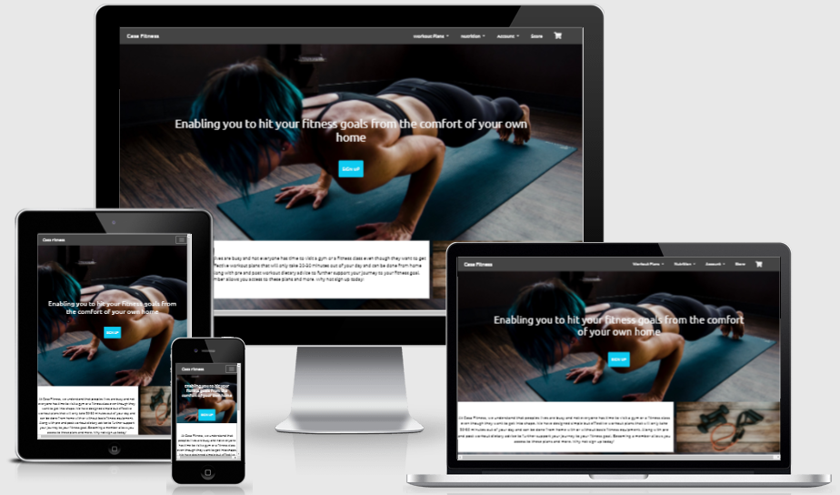

# Casa Fitness Website

#### A link to the site can be found [here](https://fitness-app-milestone-project4.herokuapp.com/)

#### Full Stack Development - Code Institute

## Table of Contents
1. [Introduction](#introduction)
2. [User Experience](#user-experience)
3. [Wireframes](#wireframes)
4. [Database Design](#design)
5. [Features](#features)
6. [Testing](#testing)
7. [Deployment](#deployment)
8. [Credits](#credits)

### Introduction
#### The Casa Fitness website is a source of information for anyone at any level who wants to get involved in fitness and nutrition for a healthier lifestyle. It provides workout plans that all can be done from home while pre and post exercise nutrition are available for all registered users.

### User Experience

The website will have workout and nutrition information for registered users that is simple to navigate to via menu's and a store for sourcing the exercise equipment that will enhance their workout. The store is available to non registered users.

User Stories to help achieve this user experience:

Visitor:

1. As a visitor to the application I want to be able to view and purchase from the online store.
2. As a visitor to the application I want to be able to register so I can become a member.

User:

1. As a user I want to be able to login to the application so that I have access to the various elements of my membership.
2. As a user I want to be able to view the workout plans so I can decide which workout to perform.
3. As a user I want to be able to view the nutritonal information so I can decide if I want to use any of them.
4. As a user I want to be able to purchase the exercise equipment that is on offer so I can use it during my workouts.
5. As a user I want to be able to view my purchase history so that I can view what I bought previously.

Administrator:

1. As an administrator of the application, I want to have the functionality to change details on products so that I can implement updates when required.
2. As an administrator of the application, I want to ensure only administrators have the ability to update the application so that no members or visitors can make changes.

### Wireframes

 - [Index Page](Wireframes/homepage.jpg)
 - [Workouts Page](Wireframes/workouts.jpg)
 - [Nutrition Page](Wireframes/nutrition.jpg)
 - [Store Page](Wireframes/store.jpg)

 

### Database Design

During development, the sqlite3 database that is provided by Django was used before using PostgreSQL in the production release. 3 tables of data were created:
 - products. This contains the products that are available to be purchased on the sites store.
 - workouts. This table has each individual workout that can be used to add to the workout plans.
 - categories. This holds the category that each workout is associated to.

### Features

Existing features:

 - The site opens up on the index page which contains a home workout image and button allowing users to **sign up**.
 - The Workouts menu drop down has a link to the **HIIT workout plan**. This can only be viewed by registered users. If not registered, a message appears advising this is for only members of the website.
 - The Nutrition menu drop down has a link to the **Pre & Post workout nutrition information**. This can only be viewed by registered users. If not registered, a message appears advising this is for only members of the website.
 - There is an account drop down that allows members to find their **purchase history** and their delivery information.
 - The store link takes users to the store page where they can **purchase exercise equipment**.
 

Features left to implement:

 - A link that provides the recipes for the pre & post workout food.
 - More workout pages including Yoga and Weight training.
 - Videos or instruction for each exercise noted on the workout plans.

#### Technologies Used

#### Languages:

* HTML5
* CSS
* Javascript
* Python
* JSON

#### Tools / Libraries / Frameworks

* Django
* Stripe
* AWS
* JQuery
* Git
* Bootstrap 4.7
* Fontawesome
* TinyPng

### Testing

The following testing was performed to test functionality, browser compatibility, responsiveness and that the user stories documented above are fulfilled by the completed site.

#### Functionality

Test | Action | Expected Outcome | Test Outcome |
---- | ------ | ---------------- | ------------ |
 NAV Menu Links. | Selecting each NAV menu from each individual page. | The page selected loaded and required. | PASS
 Sign Up Button | Selecting the button produces the form to register to the site | The sign up form is loaded | PASS
 Account Log In | Selecting the Log In link from the Account menu produces the log in form | The log in form is loaded | PASS
 Register | Selecting the Register link from the Account menu produces the form to register | The register form is loaded | PASS
 Account | Selecting the My Profile link from the Account menu once logged in produces the users profile details | The User Profile page loads | PASS
 Product Detail | Clicking on a product within the store page loads the detail information of the product | The product detail page loads | PASS
 Checkout Process | Add products to the cart and complete checkout form including adding payment information | Delivery and payment information form is loaded and completed | PASS
 Logout | Selecting the Log Out link from the Account menu | Logout page loads and requests user to confirm logging out | PASS

 

#### Browser Capability

The website and functionality has been tested on the following devices:
 - Iphone 6s
 - Ipad 5th Generation
 - Iphone 12
 - Samsung Galaxy A20

The website and functionality has been tested on the following browsers:
 - Chrome (version 88.0.4324.190)
 - Edge (version 88.0.705.81)
 - Safari (version 14.4.1)

#### Performance

Performance of the website was tested using the Lighthouse function as part of Google developer tools. It was tested for desktop and mobile performance. While the desktop performance was ok the mobile performance was rated as poor and significant work is required to improve this.

#### Code Validation

The HTML, CSS and Javascript were validated by using the different tools below.

[HTML Validator](https://validator.w3.org/)

 - An issue was highlighted by the validator regarding a stray end tag however the code shown on the validator [here](testing/html_validator.png) does not match what is in the code in Git [here](testing/git_code.png).
 - The validator did highlight a large number of errors which relate to the table used in the workouts.html template. Upon review I believe this relates to how the for loop is working to pull in the exercises however I was not able to resolve this in time for project submission.
 - Another error was noted on stating the width to be 100% for the equipment.jpg file. This has been updated in the CSS however has not been picked up in the deployed site. Again this was not able to be resolved before submitting the project.
 - The Pre & Post Workout headers are also effected by the CSS changes not flowing through. These do not have the correct margin and are not the correct height or placement in the deployed version.

[CSS Validator](https://jigsaw.w3.org/css-validator/)

The Javascript code was checked and no issues found.

[Python Validator.](http://pep8online.com/)

#### Responsiveness

[Responsinator](http://www.responsinator.com/) - The main image on the home page could be amended to be responsive and reduce for smaller devices.

#### User Stories Test

To ensure the website met the expectations set by the users and stakeholders listed previously, testing was performed against their criteria.

##### Visitor

The website has the functionality for non registered users to use the store and purchase equipment while also giving the functionality to register as a new member.

#### User

Registered users have access to the workout and nutritional information that non registered users do not. This gives the incentive to register and become a member of the site. It also allows them to view their purchase history as part of their profile.

##### Admin Owner

The administrator of the site has access to add, edit and delete products from the store.

#### Defects Found during testing:

1. Products from the store would not load.
    - Error identified that the field rating did not exist. It was not added to models.py and when added, the change was not migrated initially.
2. Webhooks from Stripe kept failing with a 401 error.
    - The browser was not set to public, once done then webooks were successful.
3. Class of text-right not working.
    - Identified that Bootstrap now uses text-end.
4. Images were not pulling through in pre-post workout templates after deploying to Heroku.
    - Updated code to {{ MEDIA_URL }} for each image.

### Deployment

This project is stored [GitPod]() and is hosted using [Heroku](https://fitness-app-milestone-project4.herokuapp.com/).

#### Running the Project Locally

To run the project locally you will have to clone it first. Follow the below steps to perform the clone:

1. Within **GitHub**, locate and select the repository named **MarcJPH/Milestone-Project-4**.
2. When within the main page of the repository, select the **Code** button which can be found above the list of files section.
3. Select the option of **"Clone with HTTPS"** and then select the copy button which is the clipboard icon.
4. Go to **Workspaces** within GitPod and select the location where you want to place the cloned directory.
5. In the terminal window, type **"git clone"** and then paste the url that was copied from the directory within GitHub. Then press **enter**.
6. Upon pressing enter, the local clone of the directory will be made.
7. Create and start a new environment with 'python -m .venv venv' in the terminal.
8. Initialise the environment with the '.venv\bin\activate' command.
9. Then install the requirements and dependencies from the requirements.txt file - 'pip3 -r requirements.txt' in the terminal window.
10. Create a new file called env.py which you will add your environment variables into. The variables are listed below:
    - import os
    - os.environ.setdefault("STRIPE_PUBLISHABLE", "secret key here")
    - os.environ.setdefault("STRIPE_SECRET", "secret key here")
    - os.environ.setdefault("DATABASE_URL", "secret key here")
    - os.environ.setdefault("SECRET_KEY", "secret key here")
    - os.environ.setdefault("AWS_ACCESS_KEY_ID", "secret key here")
    - os.environ.setdefault("AWS_SECRET_KEY", "secret key here")
11. Add the env.py file to .gitignore file.
12. Enter 'python3 manage.py make migrations' and then 'python3 manage.py migrate' into the terminal.
13. To create a superuser for the site, enter 'python3 manage.py createsuperuser' into the terminal.
14. You can then run it with the command 'python3 manage.py runserver'.
15. Use localhost:8000 on your browser to view the website.
16. Add /admin to the end of the url in the browser and login using your superuser credentials to access the admin functionality.

#### Deploying to Heroku using Gitpod

To deploy to Heroku using Gitpod, follow the below steps:

1. Create a procfile in the workspace and add 'web: gunicorn fitness_app.wsgi:application' into the file.
2. Create a requirements.txt file that contains the list of dependencies the project requires. Type 'pip3 freeze --local > requirements.txt' in the terminal.
3. Push the new files to the repository.
4. On the Heroku dashboard, create a new application.
5. Set your deployment method under the Deploy tab and select your GitHub repository.
6. Within the Settings tab under Config Vars, set the following variables:
    - DATABASE_URL | 'your_database_url'
    - SECRET_KEY | 'your_secret_key'
    - STRIPE_PUBLIc_KEY | 'your_stripe_public_key'
    - STRIPE_SECRET_KEY | 'your_stripe_secret_key'
    - AWS_ACCESS_KEY_ID | 'your_aws_access_key_id'
    - AWS_SECRET_ACCESS_KEY | 'your_aws_secret_access_key'
7. Select the deploy button on Heroku under the deploy tab.

### Credits

#### Media

The static images of the activity places were sourced from their own websites.

 - [Yoga Mat - Alpine trek](https://www.bfgcdn.com/1500_1500_90/801-0062-0411/supernatural-yoga-mat.jpg)
 - [Dumbbell Set - Maxstrength.net](https://23.cdn.ekm.net/ekmps/shops/powerstar/images/g259-adjustable-dumbbells-sets-weight-25kg-set-8816-p.jpg?v=332021-092756)
 - [Adjustable kettlebell - Home Gym Experts](https://www.homegymexperts.co.uk/wp-content/uploads/fitness-house-adjustable-kettlebell-1024x768.jpg)
 - [Trx Suspension Bands - Argos](https://media.4rgos.it/i/Argos/3446269_R_Z001A?w=750&h=440&qlt=70)
 - [Trx rocker - TRX](https://cdn11.bigcommerce.com/s-yqe24pprmf/images/stencil/1920x1920/products/272/1375/Rocker_1920x1080_pdp_product_26inch__33583.1574156606.jpg?c=2)
 - [Adjustable stepper - OnBuy](https://assets.onbuy.com/i9/product/4322383eb9ca4cbfba6afc56a251ad26-m9640358/gym-master-adjustable-aerobic-workout-home-exercise-stepper-board-yoga-step-up.jpg)
 - [Avacado Toast](https://www.brit.co/media-library/image.jpg?id=21360448&width=1200&coordinates=0%2C100%2C0%2C100&height=600)
 - [Grilled Chicken](https://thumbs.dreamstime.com/z/healthy-lean-grilled-chicken-breast-couscous-sliced-savory-roasted-vegetables-including-courgette-peppers-tomato-97162181.jpg)
 - [Salmon and Sweet Potato](https://static.onecms.io/wp-content/uploads/sites/44/2019/08/26232745/5050771.jpg)
 - [Protein Smoothie](https://www.sweetashoney.co/wp-content/uploads/Blueberry-Raspberry-Smoothie-healthy-berry-smoothie.jpg)
 - [Omelette and toast](https://thumbs.dreamstime.com/z/close-up-healthy-breakfast-egg-omelet-wholegrain-toast-cream-cheese-pesto-cherry-tomatoes-pink-plate-black-stone-165109123.jpg)
 - [Kale salad](https://infinetaste.com/wp-content/uploads/2019/05/Superfood-3-sized.jpg)

 

#### Code

 - Changing toggler icon colour - [GeeksforGeeks](https://www.geeksforgeeks.org/how-to-change-hamburger-toggler-color-in-bootstrap/)
 - Adding cart count to navbar - [Solodev](https://www.solodev.com/blog/web-design/how-to-show-the-total-number-of-items-in-customer-shopping-carts.stml)

#### Acknowledgements

A big thank you to my mentor, Brian Macharia for his patience and support through this project which has been a massive help during this period.

 ##### Disclaimer
The content of this Website is for educational purposes only.